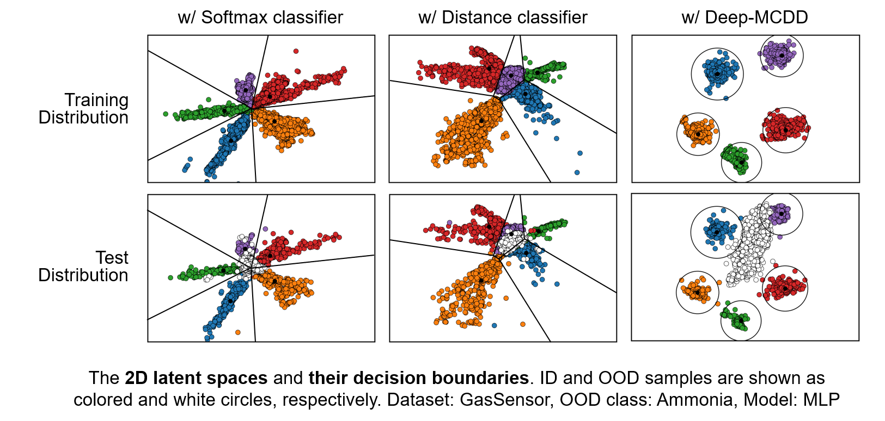

# Multi-class Data Description for Out-of-distribution Detection

This is the author code of ["Multi-class Data Description for Out-of-distribution Detection"]().
Some codes are implemented based on [Deep Mahalanobis Detector](https://github.com/pokaxpoka/deep_Mahalanobis_detector).

## Overview

<p align="center">

</p>

> Multi-class data description, termed as **Deep-MCDD**, learns class-conditional Gaussian distributions (or spherical boudnary for each class).

## Downloading tabular datasets

The four multi-class tabular datsets used in the paper can be downloaded from the below links.
We provide the preprocessed version of the datasets, which are converted into numpy array so that it can be directly loaded.

- **GasSensor**: [[Numpy format]](http://di.postech.ac.kr/donalee/gas_preproc.npy) [[Raw format]](https://archive.ics.uci.edu/ml/datasets/Gas+Sensor+Array+Drift+Dataset#)
- **Shuttle**: [[Numpy format]](http://di.postech.ac.kr/donalee/shuttle_preproc.npy) [[Raw format]](https://archive.ics.uci.edu/ml/datasets/Statlog+(Shuttle))
- **DriveDiagnosis**: [[Numpy format]](http://di.postech.ac.kr/donalee/drive_preproc.npy) [[Raw format]](https://archive.ics.uci.edu/ml/datasets/Dataset+for+Sensorless+Drive+Diagnosis)
- **MNIST**: [[Numpy format]](http://di.postech.ac.kr/donalee/mnist_preproc.npy) [[Raw format]](http://yann.lecun.com/exdb/mnist/)

## Downloading image datasets

The three in-distribution datasets (i.e., **SVHN**, **CIFAR-10**, and **CIFAR-100**) would be downloaded from ``torchvision``.
We use the download links of two out-of-distributin datasets (i.e., **TinyImageNet** and **LSUN**) from [Deep Mahalanobis Detector](https://github.com/pokaxpoka/deep_Mahalanobis_detector) and [ODIN Detector](https://github.com/ShiyuLiang/odin-pytorch).

## Running the codes

- python
- torch (GPU version only)

### for tabular data
```
python train_deepmcdd_iamge.py --dataset gas --oodclass_idx 0
```

### for image data
```
python train_deepmcdd_image.py --dataset svhn --net_type resnet
```

## Citation
```
  to be updated
```
